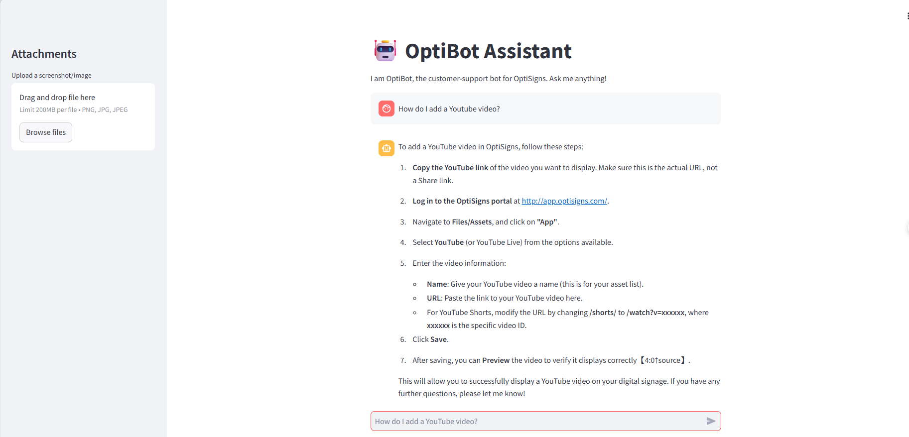

# OptiBot Mini-Clone

This repository contains the implementation of the OptiBot Mini-Clone, integrating with the Zendesk API and OpenAI to build a smart customer support assistant.

## Overview
- **Task 1:** Scrapes articles from `support.optisigns.com` (Zendesk API) and normalizes them to clean Markdown.
- **Task 2:** Uploads the knowledge base to an OpenAI Vector Store and initializes an OpenAI Assistant using the `gpt-4o-mini` model.
- **Task 3:** Implements a delta-sync strategy to only upload new or updated articles to minimize API costs.
- **Task 4:** Provides a clean web-based Chat UI using Streamlit for end-users to interact with the assistant.

## 📊 Daily Job Logs
You can view the execution logs of the daily data scraping and syncing job on GitHub Actions here:
👉 **[View Daily Sync Job Logs](https://github.com/tungnhann/testChatBotNTN248/actions)**

## 📸 Demo
👉 **[Live Web App Demo](https://testchatbotntn248.onrender.com)**

Here is a screenshot of the assistant successfully answering a sample question based on the scraped knowledge base:


## 🛠️ Setup & Run Locally

1. **Clone the repository:**
   ```bash
   git clone https://github.com/tungnhann/testChatBotNTN248.git
   cd testChatBotNTN248
   ```

2. **Install dependencies:**
   ```bash
   pip install -r requirements.txt
   ```

3. **Configure Environment:**
   Create `.env` and add your OpenAI API Key:
   ```env
   OPENAI_API_KEY=sk-your_actual_key_here
   ```

4. **Run the Daily Job (Scrape & Sync):**
   ```bash
   python main.py
   ```
   *This will scrape data to the `data/` directory and upload it to your OpenAI Vector Store.*

5. **Test the Assistant (Chat UI):**
   ```bash
   streamlit run app.py
   ```
   *This starts the web chat interface where you can ask questions based on the synced knowledge base.*

## 🚀 Deployment Guide (Microservices Architecture)

This system is designed with a decoupled architecture, separating the Chat UI from the Background Data Sync Job to optimize performance and hosting costs.

### 1. Deploy the Data Job (Scraper & OpenAI Sync) via GitHub Actions
This handles running the background job at 00:00 UTC every day to keep the bot's knowledge base up to date.
1. Push your code to a GitHub repository.
2. Navigate to **Settings > Secrets and variables > Actions**.
3. Click **New repository secret**.
   - Name: `OPENAI_API_KEY`
   - Secret: Your actual OpenAI API key.
4. Go to the **Actions** tab in your repository. The `Daily Sync Job` workflow is pre-configured and will automatically run every midnight. You can also trigger it manually by clicking `Run workflow`.

### 2. Deploy the Chat UI (Streamlit Web App)

**Using Render.com**
1. Log in to [Render.com](https://render.com/) and create a **New > Web Service**.
2. Connect it to your GitHub repository.
3. Configure the service:
   - **Environment**: Docker
   - **Branch**: main
4. Scroll down to **Environment Variables** and add:
   - Key: `OPENAI_API_KEY`
   - Value: Your OpenAI API key.
5. Click **Create Web Service**. Render will automatically read the `Dockerfile` and serve your Chat UI.


## Docker Deployment (Manual)
If you wish to test the Dockerized UI locally before deploying to production:
```bash
docker build -t optibot-ui .
docker run -p 8501:8501 -e OPENAI_API_KEY=your_key_here optibot-ui
```
Open `http://localhost:8501` in your browser.

## Chunking Strategy
Instead of manually splitting documents into arbitrary character chunks (which loses context), **we utilize the OpenAI Vector Store & File Search tool**.
- **Strategy:** Each full Markdown article is uploaded directly to the Vector Store.
- **Why:** OpenAI's File Search automatically handles the chunking, embedding, and semantic retrieval, ensuring the AI maintains perfect context of the article structure, leading to highly accurate citations and factual responses without the complexity of manual LangChain chunking.
